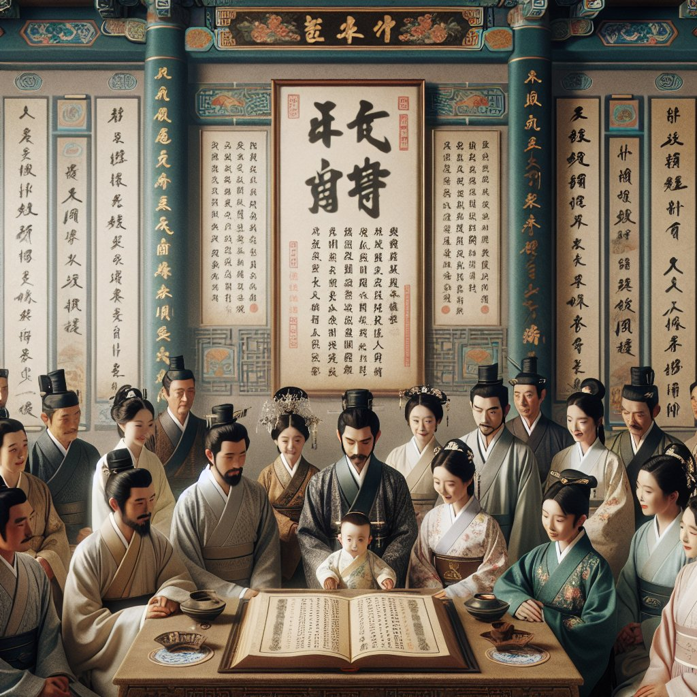

# 中国古代中国宝宝起名历史

摘要：

**中国古代的宝宝起名有着悠久和丰富的历史，主要体现在1、命名的文化背景；2、取名的方式与方法；3、姓名的社会功能。**其中，文化背景是最为重要的因素之一，这不仅涉及家庭期望，还包含社会风俗和哲学思想等。许多人相信名字会对个人的一生产生影响，因此，起名往往需要反复斟酌。

一、起名的文化背景

在古代，命名不仅是一个简单的称呼方式，还承载了文化、家庭期待和社会责任等多重意义。儒家思想强调父母对孩子的期望，以及名字中蕴含的德行和美好祝愿。在道教和佛教的影响下，人们也时常会选择与宗教相关的名字，以祈求保佑和吉祥。

汉字的特殊性在命名过程中起到了不可替代的作用。每一个汉字都有其独特的意义和寓意，这使得古代中国人的命名充满了深奥的智慧与文化内涵。例如，“明”字代表光明与智慧，而“谦”字则代表谦虚和礼让。这些具有深刻含义的字词被广泛应用于宝宝的名字中，以达到承载美好愿望的目的。

二、取名的方式与方法

古代取名的方法多种多样，其中常见的包括通过五行八字、典籍取名和生肖取名。五行八字法依据孩子出生的时间、地点，通过计算其八字来找到适宜的名字。这种方法相信名字可以调和命主的五行，带来好运。

典籍取名则是从经典文学或者历史典籍中选取富有意义的字词进行组合。例如，《论语》、《诗经》以及《楚辞》等经典著作中都包含了大量适合用于命名的汉字和词组。通过这种方式，不仅能够赋予名字更高的文化价值，还能体现父母的学识和修养。

生肖取名是根据孩子的生肖属性进行取名的方式。这种方法融合了民俗和传统信仰，认为名字中的某些字可以与孩子的生肖属性相协调，从而带来吉利和平安。例如，属龙的孩子可能会使用带有“龙”、“辰”的字进行命名，以期望孩子如龙一样勇敢和强大。

三、姓名的社会功能

名字不仅是个人身份的象征，还是社会关系和习俗的重要组成部分。在中国古代，姓氏的传承和起名的规范性具有极为重要的社会功能。姓氏不仅是一种家族标志，更是维系家族关系和社会结构的基本单位。不同姓氏之间的联姻和交往会对家族的地位和声望产生深远影响。

此外，不同社会阶层和职业的人在起名时也会表现出各自的特点。官员和学者通常会选择书香气息浓厚的名字，以显示其文化修养。而商人则可能会选择带有财富或成功寓意的名字，以期望事业有成。普通百姓则更多地会选择一些简单朴实但寓意美好的字词，希望孩子能够健康成长。

四、现代的传承和变化

尽管现代社会发生了巨大的变化，但很多古代的起名传统仍然保留在现代的家庭生活中。现代的父母依然会参考五行八字、经典典籍和生肖等传统方式为孩子取名。同时，随着全球化的发展，越来越多的家庭开始采用国际化的名字，以期望孩子能够在多元化的社会中更好地融入和发展。

在线宝宝起名服务的出现使得现代家庭在为宝宝选择名字时拥有了更多的便利。这些服务结合了传统的命名方法和现代的技术手段，为家长提供了丰富的名字选择和专业的命名建议。有了这些工具，父母不再需要花费大量时间和精力去查找合适的名字，而是可以更轻松地找到符合自己期望的名字。

综上所述，中国古代的宝宝起名有着复杂且丰富的历史背景，通过了解这些文化和习俗，我们可以更好地理解和传承这一重要的文化遗产，同时也能在现代社会中找到适合自己家庭的命名方式。

---

**FAQs:**

**1. 古代中国的姓名体系有何特点？**

古代中国的姓名体系非常严谨，姓氏和名字都会有特定的含义和传承方式。姓氏通常表示家族的血脉关系，而名字则承载了家庭期望、文化内涵和社会功能。姓名不仅是个人身份的象征，也是社会和家庭关系的重要组成部分。

**2. 为什么古代人会选择从经典典籍中取名？**

因为经典典籍中包含了大量富有文化价值和深刻意义的字词。从经典典籍中取名不仅能够赋予名字更高的文化价值，还能体现父母的学识和修养。此外，这种方式也有助于传承文化和教育下一代。

**3. 现代社会中还有哪些古代取名传统被保留？**

尽管现代社会发生了巨大的变化，但很多古代的起名传统依然保留。例如，很多家庭依然会参考五行八字、经典典籍和生肖等传统方式为孩子取名。随着科技的发展，在线宝宝起名服务也结合了这些传统方法，提供专业的命名建议。