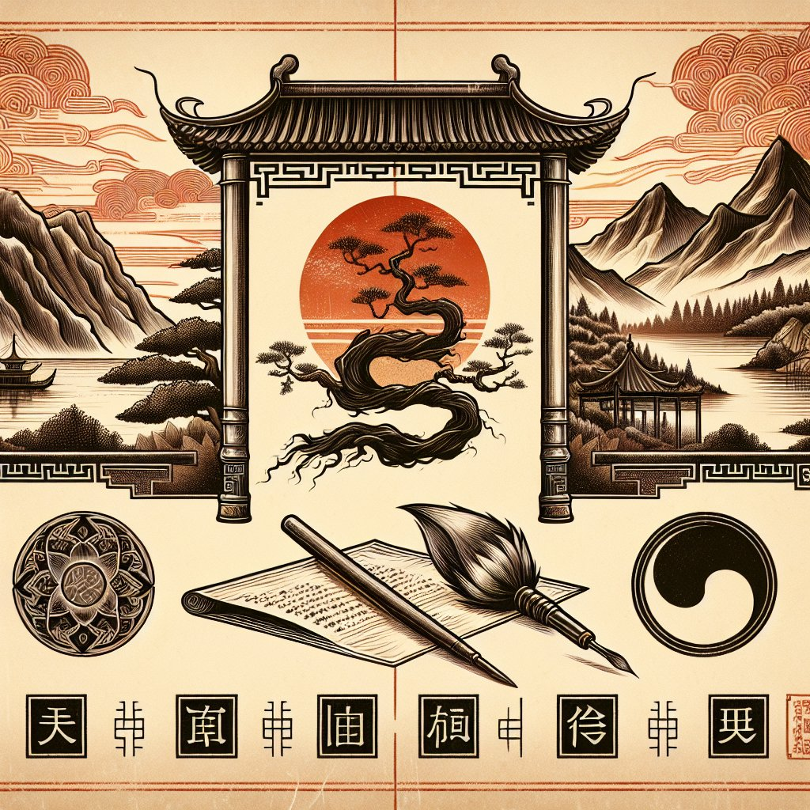

# 五行八字解析：找到与宝宝最契合的名字

## 摘要：

**五行八字起名**是一种根据传统中国玄学，为孩子选择适合名字的方法。核心思想包括：1、**八字五行分析**，2、**补充五行缺失**，3、**避免冲克八字**，4、**音韵美感**，5、**文化内涵**。其中，八字五行分析尤为重要，通过生日生成八字及其五行分布，再根据五行平衡原则进行调节。例如，若八字中火元素不足，可以在名字中加入带有火属性的字以达到五行平衡。这不仅有助于提高孩子未来的运势，还能增强其人格特质。

## 一、八字五行基本概念

### 1、什么是八字？

八字，又称四柱，是依据年、月、日、时四个时间单位，用天干地支表示生日的组合。每个时间单位分别由一个天干和一个地支组成，共计八个字，因此称为“八字”。例如，一个出生在某年月日时的宝宝，其八字可能显示为“甲子、乙丑、丙寅、丁卯”。

### 2、五行的概念及其相生相克

五行，即金、木、水、火、土五种元素。它们之间存在相生相克的关系：“金生水、水生木、木生火、火生土、土生金”称为相生；“金克木、木克土、土克水、水克火、火克金”称为相克。这种相生相克的关系是实现自然平衡的基础，也是八字命理分析的核心原理。

## 二、如何通过八字五行起名字

### 1、八字五行分析

首先，需要确定宝宝的生日八字，具体步骤如下：

- 查找天干地支对照表，根据宝宝的出生年份找到相应的年干支。
- 按照出生月份、日期和时辰，依次查找相对应的天干地支。

该方法的目的是确定宝宝的八字，进而分析五行的总体分布情况。例如，如果某宝宝的八字为“甲子、乙丑、丙寅、丁卯”，则其包含木（甲、乙）、火（丙、丁）、水（子）、土（丑、寅）等元素。

### 2、五行缺失补充

接下来，通过八字确定五行的旺衰和缺失。例如，若八字中的火属性较弱，则需要通过名字来补充火元素。火元素可以通过增加带有火属性的汉字来补足，如“炎”、“火”等字。

**五行缺失补充并不是简单的字面添加，而是综合考虑宝宝的整体命理。**这不仅仅体现在名字的意义上，还体现在具体用字的音韵和文化内涵上。

## 三、避免冲克八字

### 1、判断八字冲克

在确定名字时，还需注意避免与宝宝的八字五行相冲克。这就是所谓的“基因平衡”。如果宝宝的八字中木属性过旺，那么起名字时就要避免再使用木性质的字，以免造成五行偏向某一方，引发不平衡。

### 2、具体操作实例

假设一个宝宝的八字显示木属性极强，而缺乏金属性。那么，在起名时，就应避开过多的木属性字，可以选用一些含金属性的字，如“钟”、“锐”等，以达到五行平衡的效果。

## 四、名字的音韵美感

### 1、声韵平衡

名字的音韵美感也是一个重要因素。好的名字不仅讲究五行平衡，还需具备良好的音韵，让人听起来悦耳动听。三字名字通常能很好地达到这种平衡，例如“李谷雨”，“彼泽”等名字，不仅便于记忆，也富有音韵美感。

### 2、避免谐音歧义

在选择名字的过程中，还需注意避免出现不好的谐音或歧义。例如，“马大哈”这个名字，如果不用心挑选可能会含有“粗心大意”的意思，显得不够严谨和正式。因此，应尽量选用音韵和谐且无不良谐音的名字。

## 五、名字的文化内涵

### 1、传统文化意蕴

宝宝的名字不仅代表个人，还往往寄托了父母的期望和祝福。因此，在选择名字时，应该尽量赋予名字一定的文化内涵。传统文化中如《诗经》、《楚辞》、四书五经等经典著作，都是取名字的重要来源。例如，“若水”，“如兰”等名字都具有深厚的文化底蕴。

### 2、现代社会需求

现代社会对名字的要求也越来越高，不仅要好听，还要符合时代的潮流。例如，很多家长在给孩子取名字时，会考虑到将来的社交、职场需求，选择那些有气质和品位的名字。这不仅能够增添宝宝将来的自信心，还能在某种程度上彰显其家庭教育水平。

## 六、案例解析

### 1、实际案例一：李姓宝宝

假设一个李姓宝宝，出生于2020年5月4日11时，其八字为“庚子、壬辰、戊戌、庚午”。经过八字分析，可以看出其五行中金、水较旺，而木、火较弱。因此，建议在名字中加入一些带有木、火属性的字，如“李炎森”或“李若青”，以达到五行平衡。

### 2、实际案例二：王姓宝宝

另一个王姓宝宝，出生于2021年8月16日18时，其八字为“辛丑、乙未、戊辰、丁酉”。经过分析可以看到该宝宝八字中土、金较旺，而木、水较弱。因此，可以考虑取名“王泽林”或“王潇涵”，补充五行缺失，同时保持名字的美感和内涵。

## 七、总结与展望

**五行八字起名**不仅是中国传统文化的精髓，更是一门科学与艺术的结合。通过对八字五行的详细分析，我们能够为宝宝选取最契合的名字，以期达到五行平衡，提升其人生运势。名字是一个人一生的重要符号，具有深远的影响，值得每一位父母用心对待。

未来，随着社会的发展，更多先进的技术和理念将融入到五行八字之中，使其更具科学性和实用性。无论时代如何变迁，名字所承载的意义和文化价值将永不过时。

---

## 推荐阅读：

**如何通过五行八字为宝宝起名？**

五行八字起名是一种古老而有效的方法，通过分析宝宝的生日八字，可以找到与其五行属性最契合的名字。这种方法不仅能提升宝宝的运势，还能在很大程度上增加名字的美感和文化内涵。

**名字中五行属性如何确定？**

名字中五行属性的确定主要通过汉字的五行分类进行。不同的字具有不同的五行属性，通过合理搭配这些字可以达到五行平衡的目的。例如，带有“木”属性的字可以补充八字中缺少木元素的情况。

**为什么要避免名字中的冲克？**

名字中的冲克指的是五行属性的相互抵消或相克。长期使用带有冲克意义的名字会对宝宝的运势产生不利影响。因此，在起名字时，务必要避免出现冲克的情况，以确保名字对宝宝的正面影响。