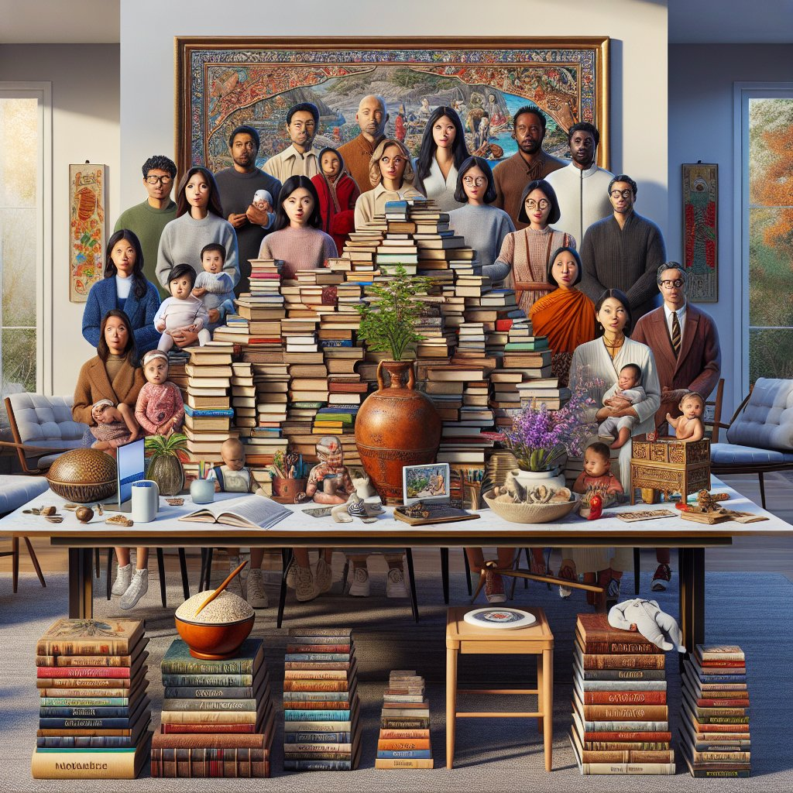

# 现代起名新趋势：与时俱进的名字选择

## 摘要：

现代起名新趋势主要包括1、**复古风的回潮**，2、**多元文化的融合**，3、**音韵美的强调**，4、**寓意的深远性**。复古风格的回潮体现在越来越多的家长开始选用祖辈使用的古老名字，这不仅寄托了对历史和家庭传统的敬意，还传递出文化传承的意味。比如，较早期的名字如“德华”、“建国”等正在重新流行。

## 一、复古风的回潮

近年来，复古风潮在起名字选择上得到了非常明显的体现。越来越多的年轻父母开始偏爱祖辈或者更早时期的名字。这种趋势不仅是对历史的致敬，也是对家庭传统的延续。古老的名字如“雅轩”、“钰涵”等逐渐重新焕发光彩。

现代社会中，人们愈发重视文化传承，通过给孩子起有历史感的名字，一方面表达对长辈的尊敬，另一方面也希望名字能赋予孩子更多的精神力量。例如，名字中的“德”、“仁”等字眼，蕴含着深厚的道德期盼。

## 二、多元文化的融合

全球化时代让多元文化的接触变得更加频繁。家长们在给孩子起名字的时候，也不再局限于本土文化。越来越多的名字开始融合来自不同文化的元素，形成独特且别具一格的名字。

例如，融合了中文和西方语言元素的名字，如“艾米丽”（Emily）中文音译为“爱美丽”，不仅好听，还赋予了意义。此外，日益多样化的文化背景也使得名字的选取更加丰富多彩，使得每个名字背后都有一个独特的故事。

## 三、音韵美的强调

在选择名字时，音韵美也是一个关键因素。一个名字如果听起来悦耳动听，往往更容易被人们记住和接受。这也是为什么越来越多的家长在选择名字时，会特别注意名字的发音和声调搭配。

比如，两个相同字眼组合的名字，如“凌霄”、“嘉嘉”，不仅简单易记，而且还带有一种特别的韵律感。另外，通过平仄声调的搭配，也能使名字更加富有音乐美感。

## 四、寓意的深远性

一个名字不仅是称呼，更承载着家长对孩子的深远期望与祝福。因此，寓意深刻的名字往往受到家长的青睐。例如，带有“希望”、“光明”或“幸福”含义的名字，不仅美好而且充满积极向上的力量。

例如，“兆丰”、“瑞雪”等名字，既有祥瑞的象征，又适当地反映了家长对孩子未来的期许和祝愿。通过名字赋予孩子无限的可能性和希望，正是现代起名的一大趋势。

## 五、高科技与现代元素的结合

随着信息技术的发展，现代父母也开始借助人工智能等技术手段来为孩子起名字。有专门的起名软件和网站，可以根据名字的声音、字形、五行等多个维度，为父母提供名字的建议。

这种高科技手段不仅提高了起名字的效率，而且还能够更科学地分析名字背后的意义和运势。例如，某些起名软件可以根据父母的姓氏、出生日期等信息，生成若干候选名字供参考。

## 六、个性化与创新型名字的兴起

在提倡个性化和创新的时代，新颖、有创意的名字也逐渐受到欢迎。家长们不再满足于传统的名字，他们更愿意为孩子起一个独特而有个性的名字，以表现自己的独特性和创造力。

这种趋势不仅体现在名字的独特性上，还包括名字的书写方式和组合形式，例如采用少见的汉字或者是自创的字形。此外，在一些特殊情况下，名字的拼音也可能经过创新，形成全新的名字格式。

## 七、环境与自然元素的影响

越来越多的家长在起名字时，也会考虑到环境和自然元素，例如花草树木、山水河流等。这种类型的名字不仅清新自然，还能体现出家长对孩子纯真和自然的期待。

举例来说，名字中带有“海”、“云”、“松”等字眼，不仅让人感受到自然的美好，也寄托了家长对孩子心灵纯净、健康成长的期盼。同时，这种类型的名字也能让人们联想到自然界中的美好事物，增加名字的感染力和记忆点。

## 八、流行文化的影响

当代影视剧、文学作品以及流行音乐等文化产品也对起名字产生了不小的影响。在这些作品中出现的角色名字，往往会成为父母们起名字的灵感来源。尤其是一些经典的角色名字，经常会引发起名字的热潮。

例如，某一部受欢迎的电视剧中的主人公名字可能会在短时间内成为热门，如“泽东”、“依萍”等。这些名字不仅广为人知，而且还带有一定的文化符号意义，使得名字的影响力超出了个人范畴，成为一种社会现象。

## 结论

总的来说，现代起名的新趋势反映了社会文化的多样性和复杂性。这些趋势不仅让名字更富有个性和意义，也展示了家长们对孩子未来的美好期许。无论是复古风潮、多元文化的融合，还是音韵美、寓意的深远性，每一种趋势都体现了现代人对名字的多层面理解和重视。

从选择名字这件小事中，我们可以窥见社会文化的演变和人们观念的变化。名字，不仅是一个人的标志，更是时代的印记。通过理解和把握这些新趋势，父母们可以为孩子起一个既有意义又符合时代潮流的好名字。