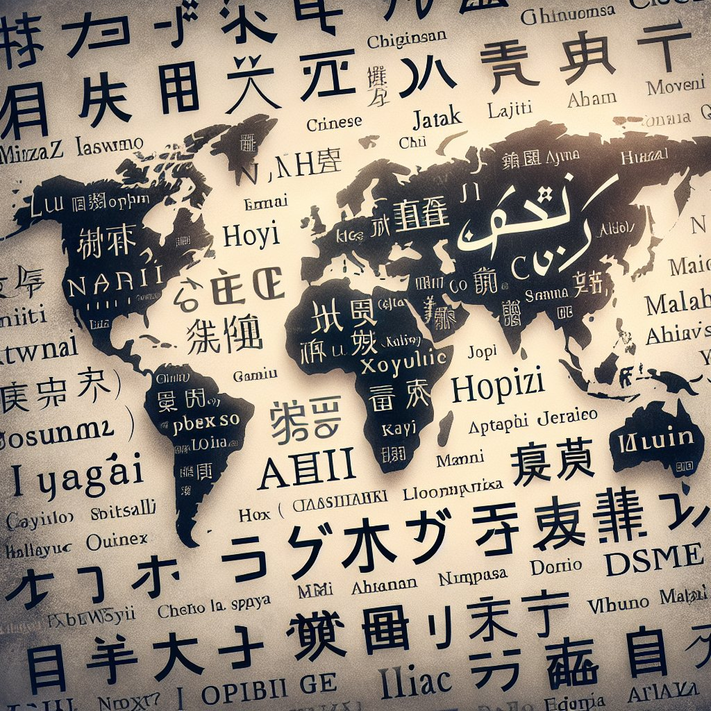

# 不同文化中的名字故事

## 摘要

名字不仅仅是个人的标识，它还承载着我们家庭和文化的历史与期望。**1、名字反映社会结构和价值观**，例如中国名字的家族传承和字辈制度；**2、名字具有独特的语音和文字特征**，如日本名字中汉字和假名的结合；**3、名字蕴含宗教和神话的元素**，如希腊名字常见的神话人物名。在详细描述方面，中国的名字文化特别注重家族传承，男孩和女孩名字中的字辈体现了家族的历史和血缘关系，这种名字结构在社会中具有重要的象征意义。

## 一、名字在家庭和社会中的象征意义

### 家族传承的名字文化

在中国，名字有着深远的文化背景和社会意义。家族传承是名字中一个重要的方面，尤其是在一些传统的家族中，名字中的某一字辈自古以来就承载着整个家族的血脉和历史。例如，一个家族可能会规定每一代人的名字都需要使用某些特定的字，以便后人能够通过名字分辨出不同代际之间的关系。这不仅是对祖先的尊敬，也是对未来的寄托和希望。

### 社会角色的体现

印度文化中的名字通常带有宗族、职业或地点的标志，反映一个人在社会中的角色和地位。例如，印度教的名字体系中，姓氏可能会表明一个人的种姓系统（caste system），这是印度社会阶层的主要分类方法。这样的名字不仅是一种个人身份标志，也是在社会互动中进行自我定位的手段。

## 二、名字的语音和文字特征

### 汉字与假名的结合

日本的名字文化体现了汉字与假名的结合，形成了独特的名字体系。日本名字通常由姓和名两部分组成，每部分可以使用汉字、平假名或片假名。汉字赋予名字以深刻的意义和美感，而假名则使得名字读起来顺滑且易于记忆。这种结合使得日本名字既有传统文化的厚重感，又有现代语言的简洁性。

### 拉丁字母与其他字母表

在拉丁美洲和欧洲国家，名字通常使用拉丁字母书写。相较于亚洲的名字，这些名字在拼写和发音上通常更加直接和简洁。然而，不同语言和地区的拉丁字母名字仍然具有鲜明的特色，例如西班牙语的名字常常包含多个单词，包括父姓和母姓，以示家族血统。此外，许多欧洲国家的名字也受到拉丁语和希腊语的影响，保留了古老的文化痕迹。

## 三、名字中的宗教和神话元素

### 希腊和罗马的神话

希腊和罗马文化中的名字常常借用神话中的人物名，以此表达对某些品质或神祇的尊崇。例如，希腊名字“亚历山大”（Alexander）源自“亚历克托斯”和“安德罗斯”，意为“人类的保护者”，这是对希腊神话和英雄主义的直接引用。同样，罗马名字如“朱诺”（Juno）或“朱庇特”（Jupiter）直接来源于罗马神话中的神祇名称，表现了对神灵的信仰和崇拜。

### 基督教和伊斯兰教的影响

在基督教文化中，许多名字直接源自《圣经》，如“约翰”（John）、“玛丽”（Mary）等，这些名字不仅具有宗教意义，而且因其经典性而广泛流传至今。在伊斯兰教文化中，名字同样具有深刻的宗教内涵，穆斯林家庭通常会选择与先知穆罕默德相关的名字，如“艾哈迈德”（Ahmed）和“法蒂玛”（Fatimah），以示对宗教信仰的忠诚和尊敬。

## 四、多文化融合中的名字演变

### 跨文化名字的融合

随着全球化的发展，跨文化名字的融合成为一种新趋势。例如，美国的多元文化导致了名字的多样化，许多移民家庭在保留原有文化特色的同时，也融入了新的名字元素。一个典型例子是韩裔美国人，他们的名字往往结合了韩语的韵味和英语的简洁性，如“Katie Kim”或“David Lee”。这种融合不仅体现在名字本身，也反映了文化身份的多重性和灵活性。

### 名字的现代化变化

现代社会中，名字的选择变得更加个性化和多样化，不再局限于传统和宗教的影响。许多年轻父母开始为孩子选择独特且具有个性化的名字，希望通过名字表现他们的创意和期望。例如，许多国家的父母会选择非传统的名字或名字拼写，以彰显独特性和创新精神。这种变化不仅反映了时代的变迁，也展示了名字作为个人标识的一种动态特质。

## 五、名字与个人身份认同

### 名字的心理影响

名字不仅是一个人的标签，还对个人的心理和身份认同有着深远的影响。一些研究表明，人们更容易对自己的名字产生情感连接，甚至名字的读音和构成会影响一个人的自尊和自信。例如，名字简单易读、含义积极的人往往更容易受到他人的欢迎和认可，从而增强自我认同感和幸福感。

### 社会认同与名字选择

与此同时，名字也是社会认同的重要部分。在多元文化环境中，名字可以作为一种文化认同的象征，帮助个体在复杂的社会网络中找到归属感。例如，移民家庭往往面临着在新文化和原文化之间寻找平衡的问题。他们可能会选择双文化名字或改名，以便更好地融入新环境，同时保留对原有文化的认同。

## 六、名字的未来趋势

### 人工智能与名字生成

随着科技的发展，人工智能开始在名字生成领域发挥作用。通过数据分析和机器学习算法，AI可以生成独特且个性化的名字，满足不同家庭的需求。这不仅提高了名字选择的效率，也增加了名字的多样性和创新性。例如，一些公司已经推出了基于AI的名字生成器，帮助准父母找到符合他们期望和文化背景的名字。

### 全球化带来的名字文化交流

全球化加速了不同文化之间的交流和融合，名字作为文化交流的一部分，也在这一过程中不断演变。未来，随着世界各国的联系越来越紧密，不同文化的名字将会相互影响和融合，创造出更多具有跨文化特色的新名字。这种趋势不仅反映了全球化的影响，也展现了名字作为文化符号的演变和发展。

通过这些角度的探讨，我们可以看到名字不仅是一种个人标识，更是文化、社会和历史的缩影。理解名字背后的故事，有助于我们更好地理解不同文化之间的差异和共性。

---

### 推荐阅读

**名字在个人发展中的心理学研究**

探讨名字如何影响个体的心理状态和社会行为。

**跨文化名字的法律与规范**

了解不同国家和文化对于名字的法律规定和命名习俗。

**科技与传统：现代名字生成技术的应用**

分析人工智能和大数据在名字生成中的应用及其对传统起名习俗的冲击。

### FAQs

**1、名字的选择会对孩子的成长产生哪些影响？**

名字的选择可能对孩子的自尊、自信以及社会交往产生影响。一个积极、有意义的名字可能增加孩子的正面社会评价，而一个比较特别或难懂的名字可能会在某些情况下导致困扰。

**2、为什么家庭传承在某些文化中很重要？**

家庭传承的名字代表了家族的历史和文化，是对祖先的致敬和对后代的期望。在一些文化中，如中国，它还具有维护家族凝聚力和明确辈分关系的重要作用。

**3、全球化对名字文化有什么影响？**

全球化促进了文化的交流和融合，使得不同文化的名字在全球范围内传播和接受。这不仅丰富了名字的多样性，还增加了文化互动和理解的机会。