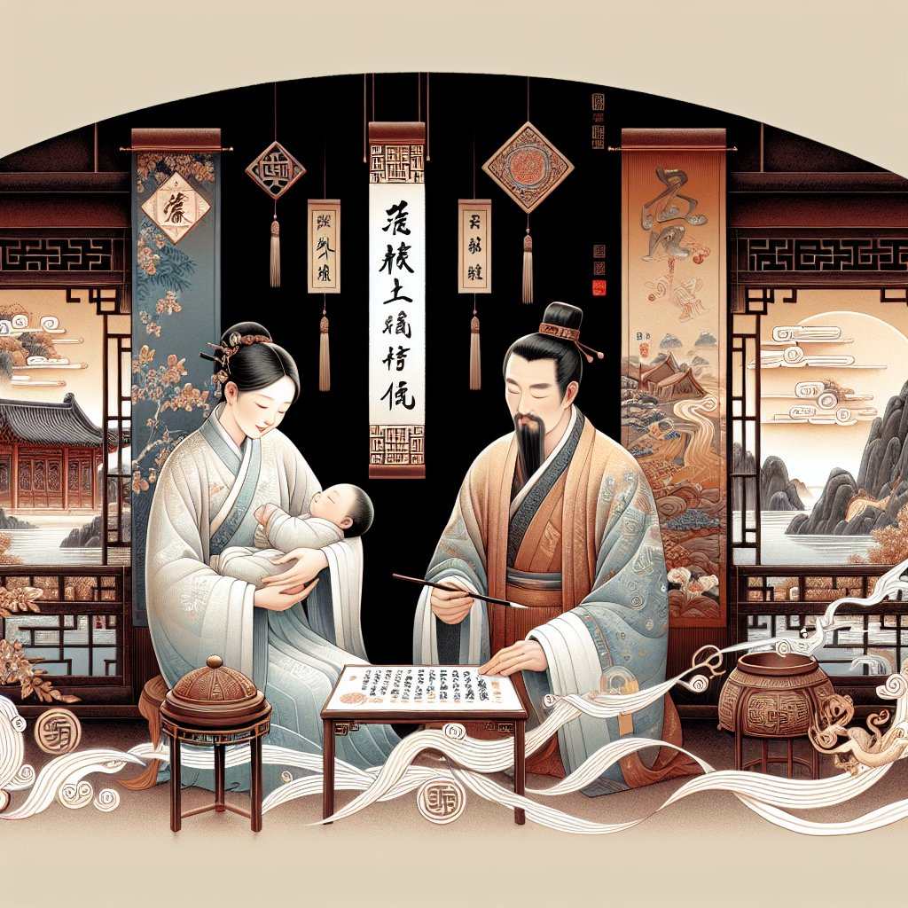

# 起名的核心原则：音韵、五行与笔画

## 摘要：

**起名的核心原则涵盖了3个重要方面：1、音韵，2、五行，3、笔画。** 这些原则相互联系，综合运用可以为孩子创造一个符合传统文化并充满意义的姓名。**1、音韵**不仅决定了名字是否悦耳动听，还可能影响到个体在社会中的形象和人际交往。**2、五行**则从历代风水学和八字命理的角度出发，通过姓名的阴阳五行平衡来调和个体的运势，确保其事业、健康和家庭更加顺利。**3、笔画**关系到姓名的写法和书写美感，并且在传统文化中，笔画数也是进行命理分析的重要因素之一。接下来，我们将详细介绍这些原则。

## 一、音韵的重要性

### 名字的音律与美感

**音韵对起名至关重要。**名字的音律是否和谐，不仅影响到日常生活中的被呼唤感受，还涉及到一个人形象和他人记忆的便捷性。**考虑声音和谐统一**，能够避免歧义或不好的联想。不论是在中文还是其他语言中，名字要易于发音，流畅和谐，尽量避免出现尖锐刺耳的音节组合。

### 读音与社会交往

名字是人与人之间最初的标签，能否让人一听就对名字的主人留下好印象显得尤为重要。**音韵顺畅的名字**不仅能使人感到愉悦，还能更容易被记住，进而提升个人在社交场合的表现和自信心。音韵和谐的名字通常会让人感到亲切友好，无形中推进人际交往的顺利进行。

## 二、五行理论的应用

### 五行相生相克

五行理论来源于古代中国的哲学体系，强调金、木、水、火、土之间的相互关系，即相生相克。**通过分析孩子的出生时间**，可以得出其八字命盘，而根据命盘所缺失的五行属性，在起名时加以补充，从而达到五行平衡，促进个体的整体运势。比如，若出生命盘中缺水，可以选择带有水属性的字。

### 调和五行与命理

在实际操作中，许多命名专家会依据五行相生相克的原则，并结合个人的八字命理，给出合理的名字推荐。**通过对五行的调和**，可以帮助人们趋吉避凶，增强个人的运势。例如，如果某人的命格中火过旺，可以通过选择带有水和土属性的字来中和，这样可以使其人生更加顺遂。

## 三、笔画数的影响

### 笔画数与命运解析

在传统文化中，姓名的每个字所含的笔画数也被认为对人有一定影响。**通过计算笔画数**，可以进行命理解析，有助于了解一个人的性格、职业发展和健康等方面的信息。例如，总笔画数为偶数的名字，可能被认为具有柔和、平稳的特质，而奇数则可能代表着刚强、积极。

### 美观与书写方便

笔画数的搭配不仅影响到命理上的解释，更直接影响到名字的书写和视觉效果。**选择书写美观的字形组合**，可以让名字更具艺术感和可读性。名字的笔画数要适中，避免过于复杂或者简单，确保在日常书写中既能够表达美感，又不会过于费力。

## 四、综合考量与实践例子

### 实际操作方法

许多父母在为孩子命名时，往往会综合考虑以上三个原则。可以通过以下具体步骤来进行：

1. **确定音韵**：筛选音韵柔和、读音顺畅的字；
2. **分析五行**：根据孩子的八字命盘缺失属性，选择相应五行的字；
3. **计算笔画**：挑选含义佳且笔画数适中的字，确保其美观与和谐。

### 案例分析

举一个具体的例子。如果一个孩子的八字命盘显示缺木，父母可以选择一些带有“木”属性的字，如“森”、“林”，再结合音韵和笔画数的考虑。例如，“李”姓的孩子，可取名“李森华”，其中“森”补充木属性，“华”则音韵和笔画数均佳，整体协调美观。

## 五、常见误区与注意事项

### 忌避重名

很多家长在为孩子取名时，会参考热门名字或名人名字，导致重名现象严重。**避免重名**不仅能使名字更加独特和个性化，还能减轻孩子在社会中的同名困扰。应当选择那些具有特殊意义，但不普及的名字。

### 文化背景与时代特征

名字不仅仅是一个符号，更是文化和时代特征的体现。**尊重传统文化，同时结合现代元素**，可以让名字既有深厚的文化底蕴，又不显得过时。例如，在现代起名时，我们依旧可以借鉴传统文化中的典故或诗词，同时注重其现代感和时尚性。

### 字形寓意与禁忌

最后，起名时还需特别注意字形和寓意的选择。个别汉字可能因为其形态或历史原因，带有负面意义或者不吉利，**需要仔细筛选**，确保名字不会因字形或寓意而产生不好的联想。例如，大部分家长会避开使用“虎”、“狗”等容易引起负面联想的字。

## FAQ 推荐阅读

**Q1: 如何利用五行原理为孩子起名？**

五行原理通过分析孩子的出生时间和八字命盘，找出命盘中缺失的五行元素，再在名字中加入相应属性的字，以此达到五行平衡。例如，一个八字命盘中缺水的孩子，可以选择带有“水”属性的字，如“淼”、“泽”。

**Q2: 音韵在起名中有什么注意事项？**

音韵最主要的是保证名字在读起来时顺畅、悦耳。孩子的名字要避免使用拼音组合尖锐刺耳、不和谐的字音。同时，名字的音韵还需考虑到是否有不良谐音，以免产生歧义或引发不好的联想。

**Q3: 笔画数对名字的影响有多大？**

笔画数不仅影响到名字的书写美观度，还在传统文化中，被用来解析命理信息。合理的笔画数搭配能够使名字更具艺术感，并且在书写过程中更加顺手、易于记忆。此外，笔画数的搭配也应遵循阴阳平衡的原则，以求达到整体和谐。

通过了解起名中的音韵、五行、笔画数三大核心原则，父母可以更科学、更全面地为自己的孩子选择一个既符合传统文化又充满现代意义的名字。在实践中综合运用这些原则，将为孩子的未来开辟更加美好的道路。